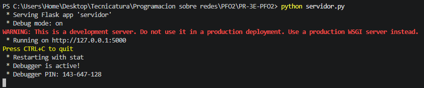
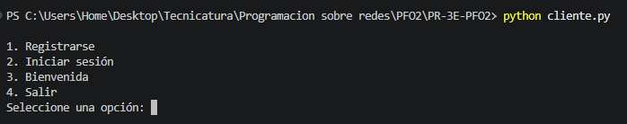
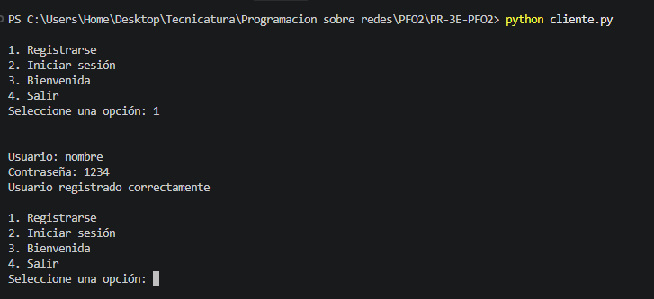
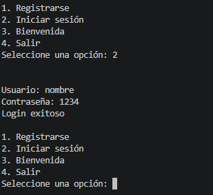
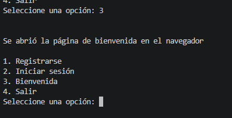
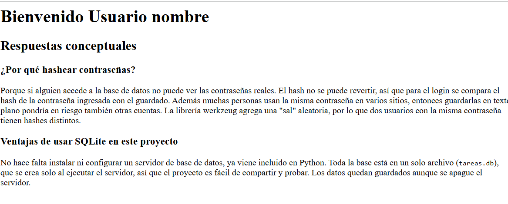
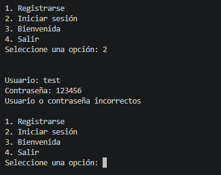
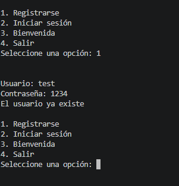

# PFO 2 - Programacion sobre redes

API hecha con Flask que permite registrar usuarios, iniciar sesión y acceder a una página de bienvenida. 
Los usuarios se guardan en SQLite con la contraseña hasheada.

## Archivos

- `servidor.py`: API Flask + SQLite
- `cliente.py`: cliente de consola para probar la API
- `requirements.txt`: librerías necesarias

## Cómo ejecutarlo

1. Instalar las librerías:  
      pip install -r requirements.txt
2. Ejecutar el servidor:   
      python servidor.py
   Queda funcionando en `http://127.0.0.1:5000` y crea la base `tareas.db`.
3. En otra terminal ejecutar el cliente:   
      python cliente.py

## Endpoints

- `POST /registro` → recibe `{"usuario": "nombre", "contraseña": "1234"}` y guarda el usuario
- `POST /login` → verifica usuario y contraseña
- `GET /tareas` → muestra un HTML de bienvenida

## Capturas | Pruebas de funcionamiento

Inicio de servidor 
Inicio de cliente 
Creacion de cliente 
Inicio se sesion 
Bienvenida en consola 
Bienvenida en navegador 
Error de user o pass 
Error al registrar 

## Respuestas conceptuales

**¿Por qué hashear contraseñas?**

Porque si alguien accede a la base de datos no puede ver las contraseñas reales. El hash no se puede revertir, así que para el login se compara el hash de la contraseña ingresada con el guardado. Además muchas personas usan la misma contraseña en varios sitios, entonces guardarlas en texto plano pondría en riesgo también otras cuentas. La librería werkzeug agrega una "sal" aleatoria, por lo que dos usuarios con la misma contraseña tienen hashes distintos.

**Ventajas de usar SQLite en este proyecto**

No hace falta instalar ni configurar un servidor de base de datos, ya viene incluido en Python. Toda la base está en un solo archivo (`tareas.db`), que se crea solo al ejecutar el servidor, así que el proyecto es fácil de compartir y probar. Los datos quedan guardados aunque se apague el servidor.

